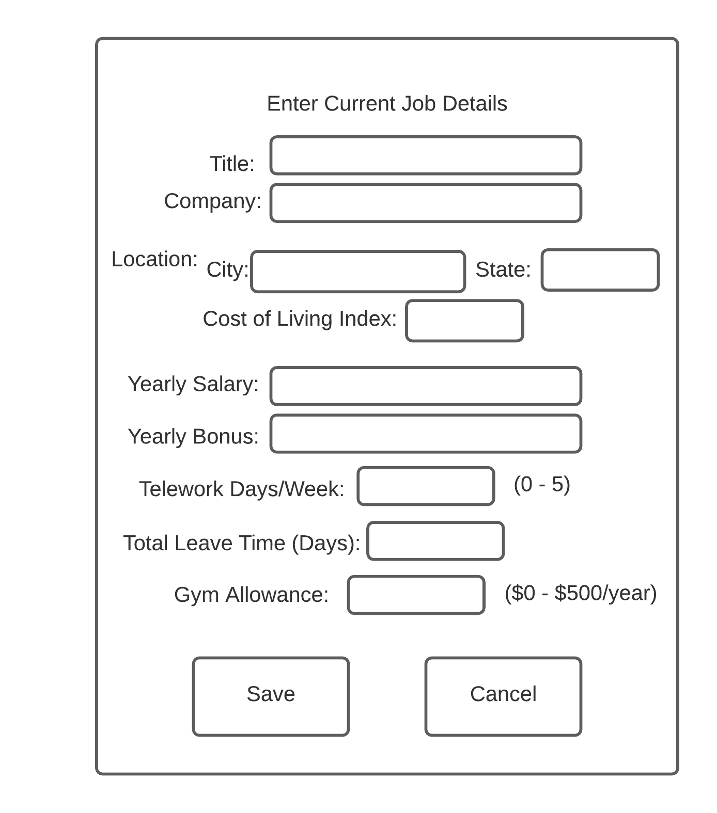
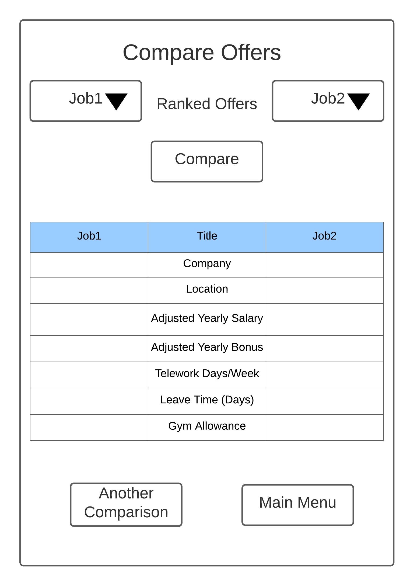

# Design Document (Version 3)

**Author**: Team100

## Change Log

* Updated Section 4 UI graphical mockups (Oct. 23, 2021)
* Revsied Component Diagram where database connects to controller (Oct. 23, 2021)

## 1 Design Considerations

### 1.1 Assumptions

* Application to be used on Android devices (only)
* Application uses the device’s storage to store user input information
* User responsible for inputting and updating parameters accordingly (e.g. updating locations’  cost of living)
* Assume that users of application are using the Android version we have developed for - we do not provide maintenance for updated versions of Android thereafter

### 1.2 Constraints

* Memory limit of device regarding number of job offers that can be added
* User can’t compare current or job offers without all fields filled in properly (i.e., can’t have blanks/null)

### 1.3 System Environment

* App is designed for applications using Pixel 4 XL with API level 29.
* App will interact the OS and device memory to storage user information

## 2 Architectural Design

### 2.1 Component Diagram

* We used a component diagram inspired by a MVC framework
* The “View” holds the UI components which will request a model update from the “Controller”
* The “Controller” holds the controller that manages access to the “Model” components and will update the “Model”
* The “Model” holds the functional components, such as Job, JobOffers, Location and ComparisonWeights, that will do the “work”. The “Model” will then update the View
* A separate component will be a database to store the required data from the Model. This association will be persistent.

Reference: [Component Diagrams](https://stackoverflow.com/questions/52807195/which-is-an-accurately-approach-of-mvcs-component-diagram)

### 2.2 Deployment Diagram

* After careful consideration, we came to the conclusion that all the required components reside within the device used. That is, we are not deploying a separate database to hold user data, we will rely on the device storage and OS to manage storage of data. Thus, because we only have one piece of hardware that the application interacts with (i.e., the device itself) we believe this system is simple enough that it does not require an explicit deployment diagram. 

## 3 Low-Level Design

### 3.1 Class Diagram

### 3.2 Other Diagrams

* While we understand there is value in adding further diagrams to elucidate our system, our requirements are simple enough that we have decided to omit behavioral diagrams. The benefit of inclusion does not outweigh the additional costs associated with developing these diagrams.

## 4 User Interface Design

