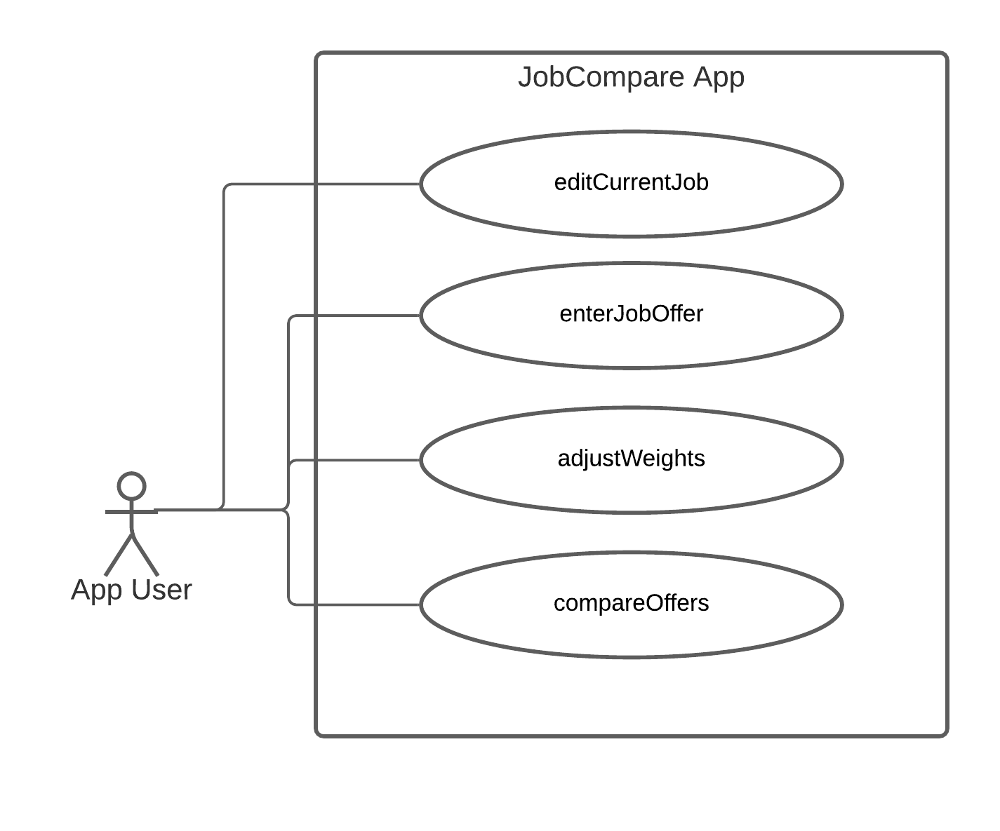

# Use Case Model

**Author**: Team100

## 1 Use Case Diagram

## 2 Use Case Descriptions

### Use case #1 enterJobOffer

- Requirements: This use case allows the user to add a new job offer to the existing dataset.

- Pre-conditions: There are no pre-conditions required before this use case is run.

- Post-conditions: If saved, the job offer will be saved to database/flat file for future use; if cancelled, the state will not be changed and job will not be added to the database

- Scenarios: When invoked, the user will be asked to input information about the new offer. Upon save, the system will first check the input location against location instances on file, i.e. locations - if such location already exists, continue, otherwise, create a new location instance and add to locations. Then, addOffer method will be invoked and current job offer will be created, job score will be calculated. Following that, the current job offer will be saved to JobOffers and added to rankedJobOffers according to the score.

### Use case #2 editCurrentJob

- Requirements: This use case allows the user to modify an existing job offer and save to the database/flat file.

- Pre-conditions: There must be at least 1 instance of JobOffers class  for the user to edit.

- Post-conditions: If saved, the job offer will be updated and saved to the database/flat file for future use; if cancelled, the state will not be changed and the job will not be changed

- Scenarios: When invoked, the user will be either asked to select a current job offer to edit or be prompted with a warning message of ‘Current job offer does not exist’. Upon selection, the user will be able to change the job offer data and save or exit. If the user saved new data, the system will first check the input location against location instances on file, i.e. locations - if such location already exists, continue, otherwise, create a new location instance and add to locations. Then, the job score will be calculated and updated within the Job instance. Following that, rankedJobOffers will be updated with the new job and new associated  score.

### Use case #3 adjustWeights

- Requirements: This use case allows the user to update the comparison weight settings and save to the database/flat file.

- Pre-conditions: There are no pre-conditions required before this use case is run.

- Post-conditions: If saved, the ComparisonWeights will be updated and saved to the database/flat file for future use; if cancelled, the state will not be changed.

- Scenarios: When invoked, the user will be asked to update the fields of current ComparisonWeights, which equals to 1 by default. Upon save, if not null, updateJobScores will be called and the new score will be computed and saved to rankedJobOffers per the new ComparisonWeights assigned. If the user cancels without saving, no change will be made to the system.

### Use case #4 compareOffers

- Requirements: This use case allows the user to compare 2 of the existing job offers.

- Pre-conditions: There must be at least 2 job offers stored in the database, which may include current job (if present), before this use case is available.

- Post-conditions: A table comparing the 2 jobs selected will display all the information for each job.

- Scenarios: When invoked, the user will be asked to select 2 of the existing job offers from a list displayed as Title and Company, ranked from best to worst according to the score, which may  include the current job (if present). Once selected, the user will be presented a table with details of the selected job offers. The user will also be able to choose to perform another comparison or go back to the main menu.

