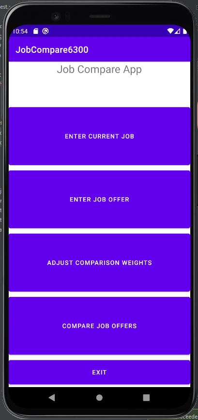
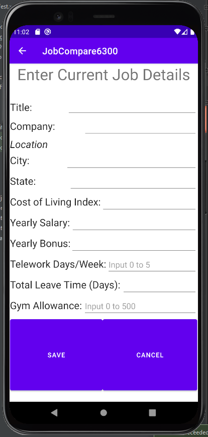
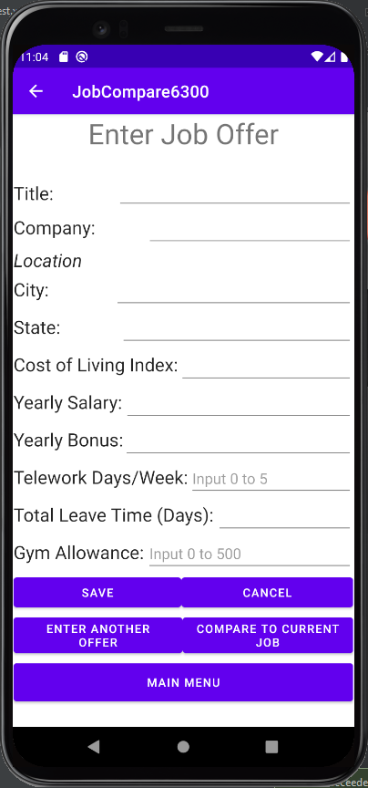
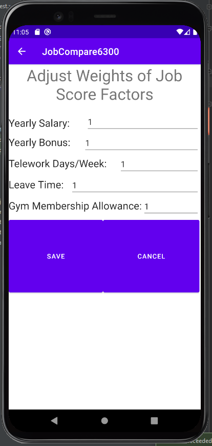
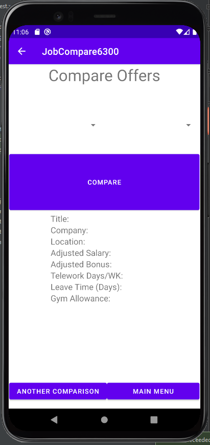

# User Manual for Job Compare App (Version 2)

## Change Log

* Add information to Compare Job Offers section to explain that spinner drop down menu will show jobs as Title, Company, and Job Score (Oct. 23, 2021)
* Add information to Compare Job Offers section to explain that current job will be clearly indicated with asterisks around information in drop down menu (Oct. 23, 2021)

## System Environment
* Application (app) is designed for the Pixel 4 XL with API level 29.
* App will interact with the operating system and device memory to store user information.

## Main Menu

Upon starting the app, the main menu will appear with the following buttons: Enter Current Job, Enter Job Offer, Adjust Comparison Weights, Compare Job Offers, and Exit. Pressing a button will lead to its respective layout, described in each of its own sections below in detail; except pressing the Exit button will exit from the app.

## Enter Current Job

Upon selecting Enter Current Job from the main menu, a layout will be shown in which can be entered details for the current job, or edit the details if a current job has been previously entered. Next to the Title, Company, City, and State labels are fields in which to enter a string for each label, providing the information asked for (such as Title, would be the title of the job; Company, the company of the job, etc.). The Cost of Living Index, Yearly Salary, Yearly Bonus, Telework Days/Week, Total Leave Time (Days), and Gym Allowance all have input fields next to them which accept integers. Telework Days/Week accepts an integer in the range of 0 to 5, to represent how many days of each week telework is permitted. Leave Time (Days), is a single overall number of days per year allotted for vacation days, holidays, and/or sick leave. The Gym Allowance input field is where the gym membership allowance, per year, is entered and is in the range of 0 to 500; an integer representing dollars. After inputting the information in all the fields, either press Save to save the job details or Cancel to exit this layout without saving, and in both cases return back to the main menu.

## Enter Job Offer

Upon selecting Enter Job Offer from the main menu, a layout will be shown, similar to the Enter Current Job layout, with the addition of a few extra buttons at the bottom which consist of Enter Another Offer, Compare to Current Job, and Main Menu. Enter the job offer details the same as the current job details in the previous section, with the same type of information and input limitations. Once all of the details have been inputted, either save the details by pressing the Save button, or press Cancel to not save the details. Press the Enter Another Offer button, to enter another job offer’s details. Press Compare to Current Job, if the job offer details have been saved, and the current job is present, to compare the job offer to the current job. Press the Main Menu button, to return to the main menu.

## Adjust Comparison Weights

Upon selecting Adjust Comparison Weights from the main menu, a layout will be shown, with all of the input fields initially filled in with a 1; this is so that if nothing is inputted (to alter the 1 in each field), they will all be equal weight. Yearly Salary, Yearly Bonus, Telework Days/Week, Leave Time, and Gym Membership Allowance are the weights that can be changed by inputting an integer into the respective field; the higher the integer, the more weight it will have in the job score computation. These weights affect the job’s score, which will be used to rank jobs in the Compare Job Offers layout (described in the next section). The inputs for each field will be limited to integers of at least 0. Once all of the weights have been inputted (or left as 1), either save the details by pressing the Save button, or press Cancel to not save any changes.

## Compare Job Offers

Upon selecting Compare Job Offers from the main menu, a layout will be shown to compare two jobs. Select the first job to be compared from the drop down menu on the left, from a ranked list of jobs based on job score. Select the second job to be compared from the drop down menu on the right, also ranked by job score. The jobs in the drop down menu will be displayed as Title, Company, and Job Score ranked from best to worst, with the current job clearly indicated (if present) with two asterisks, on each side, around its information. Once two jobs to be compared have been selected, press the Compare button to trigger the comparison; doing so will display Title, Company, Location, Yearly salary adjusted for cost of living, Yearly bonus adjusted for cost of living, Allowed weekly telework days, Leave time, and Gym Membership Allowance in the table below, with the data of the first job on the left and the data of the second job on the right, with a column between signifying what each row of data represents. Press the Another Comparison button to reset the table of values to do another comparison, by choosing from the drop down menus once again and repeating the instructions above. Press the Main Menu button to return to the main menu.

